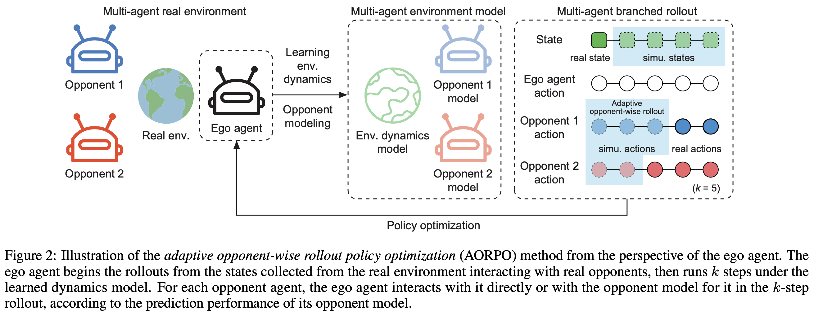
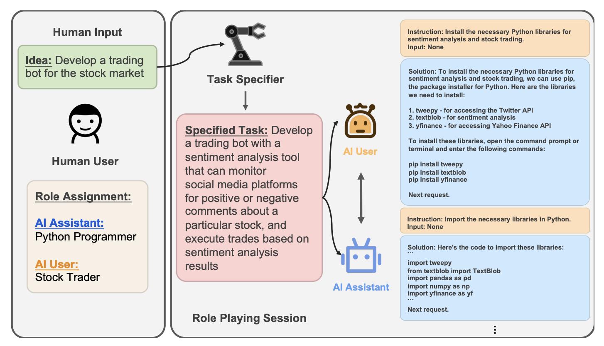

**Status:** Stable release

<!-- [](https://pypi.python.org/pypi/crafter/#history) -->

This repo contains the following two main parts: a disaster resource allocation game and a collection of algorithms to solve this game.

# Algorithms

### Heuristic-based
on supply chain management: base-stock policy

References (some quite old literature):

[Optimal policies for a multi-echelon inventory problem](http://dido.econ.yale.edu/~hes/pub/echelon1.pdf)

[Lower bounds for multi-echelon stochastic inventory systems](https://pubsonline.informs.org/doi/abs/10.1287/mnsc.40.11.1426)

[Stock positioning and performance estimation in serial production-transportation systems.](https://pubsonline.informs.org/doi/abs/10.1287/msom.1.1.77)

[Newsvendor bounds and heuristic for optimal policies in serial supply chains.](https://www.researchgate.net/publication/220534493_Newsvendor_Bounds_and_A_Heuristic_for_Optimal_Policies_in_Serial_Supply_Chains)

### Model-free multi-agent

We experiment with 2 variants: 
- A2C
- DQN
  - 
- PPO

References:

[TOM2C: TARGET-ORIENTED MULTI-AGENT COMMUNICATION AND COOPERATION WITH THEORY OF MIND](https://arxiv.org/pdf/2111.09189.pdf)


### Model-based multi-agent

References:

[Model-based Multi-agent Policy Optimization with Adaptive Opponent-wise Rollouts](https://arxiv.org/pdf/2105.03363.pdf)

Trade-off:		

- Rollouts too short → accurate opponent models not fully utilized → low sample efficiency. 
- Rollouts too long → inaccurate opponent models depart the rollouts from the real trajectory distribution heavily → degraded performance in the environment and low sample efficiency. 



### Language multi-agent

References:

[CAMEL: Communicative Agents for "Mind" Exploration of Large Language Model Society](https://arxiv.org/pdf/2303.17760.pdf)

Camel Multi-Agent Role-Playing Framework

<!--  -->



# Disaster resource allocation game
UI based on Crafter: Open world survival game for evaluating a wide range of agent abilities within
a single environment.


### Overview

- **Research challenges:** 

- **Meaningful evaluation:** 


## Play Yourself

```sh
python3 -m pip install crafter  # Install Crafter
python3 -m pip install pygame   # Needed for human interface
python3 -m crafter.run_gui      # Start the game
```

#### Interface

To install Crafter, refer to the description in their repo.

#### Evaluation

Agents are allowed a budget of 1M environmnent steps and are evaluated by their
success rates of the 22 achievements and by their geometric mean score. Example
scripts for computing these are included in the `analysis` directory of the
repository.

- **Reward:** The sparse reward is `+1` for unlocking an achievement during
  the episode and `-0.1` or `+0.1` for lost or regenerated health points.
  Results should be reported not as reward but as success rates and score.

- **Success rates:** The success rates of the 22 achievemnts are computed
  as the percentage across all training episodes in which the achievement was
  unlocked, allowing insights into the ability spectrum of an agent.

- **Crafter score:** The score is the geometric mean of success rates, so that
  improvements on difficult achievements contribute more than improvements on
  achievements with already high success rates.

## Scoreboards

Please create a pull request if you would like to add your or another algorithm
to the scoreboards. For the reinforcement learning and unsupervised agents
categories, the interaction budget is 1M. The external knowledge category is
defined more broadly.

### Reinforcement Learning

<!-- | Algorithm | Score (%) | Reward | Open Source |
|:----------|----------:|-------:|:-----------:|
| [Curious Replay](https://arxiv.org/pdf/2306.15934.pdf) | 19.4±1.6 | - | [AutonomousAgentsLab/cr-dv3](https://github.com/AutonomousAgentsLab/cr-dv3) |
| [PPO (ResNet)](https://arxiv.org/pdf/2307.03486.pdf)| 15.6±1.6 | 10.3±0.5 | [snu-mllab/Achievement-Distillation](https://github.com/snu-mllab/Achievement-Distillation) 
| [DreamerV3](https://arxiv.org/pdf/2301.04104v1.pdf) | 14.5±1.6 | 11.7±1.9 | [danijar/dreamerv3](https://github.com/danijar/dreamerv3) |
| [LSTM-SPCNN](https://arxiv.org/pdf/2208.03374.pdf) | 12.1±0.8 | — | [astanic/crafter-ood](https://github.com/astanic/crafter-ood) |
| [EDE](https://openreview.net/pdf?id=GZDsKahGY-2) | 11.7±1.0 | — | [yidingjiang/ede](https://github.com/yidingjiang/ede) |
| [OC-SA](https://arxiv.org/pdf/2208.03374.pdf) | 11.1±0.7 | — | [astanic/crafter-ood](https://github.com/astanic/crafter-ood) |
| [DreamerV2](https://arxiv.org/pdf/2010.02193.pdf) | 10.0±1.2 | 9.0±1.7 | [danijar/dreamerv2](https://github.com/danijar/dreamerv2) |
| [PPO](https://arxiv.org/pdf/1710.02298.pdf) | 4.6±0.3 | 4.2±1.2 | [DLR-RM/stable-baselines3](https://github.com/DLR-RM/stable-baselines3) |
| [Rainbow](https://arxiv.org/pdf/1710.02298.pdf) | 4.3±0.2 | 6.0±1.3 | [Kaixhin/Rainbow](https://github.com/Kaixhin/Rainbow) | -->

### Unsupervised Agents

<!-- | Algorithm | Score (%) | Reward | Open Source |
|:----------|----------:|-------:|:-----------:|
| [Plan2Explore](https://arxiv.org/pdf/2010.02193.pdf) | 2.1±0.1 | 2.1±1.5 | [danijar/dreamerv2](https://github.com/danijar/dreamerv2) |
| [RND](https://arxiv.org/pdf/1810.12894.pdf) | 2.0±0.1 | 0.7±1.3 | [alirezakazemipour/PPO-RND](https://github.com/alirezakazemipour/PPO-RND) |
| Random | 1.6±0.0 | 2.1±1.3 | — | -->

### External Knowledge

<!-- | Algorithm | Score (%) | Reward | Uses | Interaction | Open Source |
|:----------|----------:|-------:|:-----|:-----------:|:-----------:|
| [Human](https://en.wikipedia.org/wiki/Human) | 50.5±6.8 | 14.3±2.3 | Life experience | 0 | [crafter_human_dataset](https://archive.org/details/crafter_human_dataset) |
| [SPRING](https://arxiv.org/pdf/2305.15486.pdf) | 27.3±1.2 | 12.3±0.7 | LLM, scene description, Crafter paper | 0 | ❌ |
| [Achievement Distillation](https://arxiv.org/pdf/2307.03486.pdf) | 21.8±1.4 | 12.6±0.3 | Reward structure | 1M | [snu-mllab/Achievement-Distillation](https://github.com/snu-mllab/Achievement-Distillation) |
| [ELLM](https://arxiv.org/pdf/2302.06692.pdf) | — | 6.0±0.4 | LLM, scene description | 5M | ❌ | -->

## Baselines

<!-- Baseline scores of various agents are available for Crafter, both with and without rewards. The scores are available in JSON format in the `scores` directory of the repository. For comparison, the score of human expert players is 50.5\%. The [baseline implementations](https://github.com/danijar/crafter-baselines) are available as a separate repository. -->

<!--  -->

## Join this project

Please fill in this [google form](https://forms.gle/NvRKioSPaUsiva8i7).

## Questions

Please [open an issue][issues] on Github.

[issues]: 
